<p align="center">
  <h1 align="center">🚀 EasyApplyResume 易投简历</h1>
  <p align="center">一站式智能简历管理与投递平台</p>
</p>

<p align="center">
  
  
  
  
  
  
  
  
</p>

---

## 📖 目录

- [项目介绍](#-项目介绍)
- [技术架构](#-技术架构)
- [功能特性](#-功能特性)
- [核心功能展示](#-核心功能展示)
- [项目结构](#-项目结构)
- [开发进度](#-开发进度)
- [常见问题](#-常见问题)
- [参与贡献](#-参与贡献)
- [开源协议](#-开源协议)

---

## 🎯 项目介绍

**EasyApplyResume（易投简历）** 是作者准备的毕设项目。作者一直对做一个开源项目十分感兴趣，但由于课业深度不足、实习项目不允许开源等问题一直没有机会，因此趁着做毕设的机会，正好满足一下做开源项目的心愿。

本项目采用主流的前后端技术实现，包含三个子系统：

| 子系统 | 面向用户   | 核心功能 |
|--------|--------|----------|
| **用户端** | 网站访问用户 | 简历模板、制作简历、投递简历、查询招聘公司、AI求职助手 |
| **管理端** | 网站管理者  | 网站管理、文章管理、招聘管理、简历管理、反馈管理 |
| **监测与广告端** | 网站管理者  | 公告管理、广告管理、用户监测、服务器管理 |

---

## 🌐 在线演示

| 子系统 | 访问地址 |
|--------|----------|
| 用户端 | http://117.50.184.138:37222/ |
| 管理端 | http://117.50.184.138:37221/ |
| 监测与广告端 | http://117.50.184.138:37223/ |

> ⚠️ **说明**：作者正在申请域名并迁移应用，后续将部署到有域名的服务器上。

> 🔧 **本地运行**：由于涉及隐私 API Key 和 MySQL 配置等问题，本地运行指南正在设计与制作中，敬请期待！

---

## 🛠 技术架构

### 整体架构

```
┌─────────────────────────────────────────────────────────────────┐
│                          前端层                                  │
│   用户端(React)    │    管理端(Vue3)    │    监测端(Vue3)        │
└─────────────────────────────┬───────────────────────────────────┘
                              │
┌─────────────────────────────▼───────────────────────────────────┐
│                        Nginx 网关层                              │
│                    路由分发 · 负载均衡 · 静态资源                  │
└─────────────────────────────┬───────────────────────────────────┘
                              │
┌─────────────────────────────▼───────────────────────────────────┐
│                      Spring Boot 3 后端                          │
│     Spring Security + JWT · MyBatis-Plus · Spring AI            │
└─────────────────────────────┬───────────────────────────────────┘
                              │
┌─────────────────────────────▼───────────────────────────────────┐
│                         数据层                                   │
│       MySQL 8.0  ·  Redis 7.2  ·  MinIO/KODO    ·  PGVector     │
└─────────────────────────────────────────────────────────────────┘
```

### 技术栈详情

| 分类 | 技术 | 说明 |
|------|------|------|
| **架构设计** | 单体多实例 | 便于部署与扩展 |
| **后端框架** | Spring Boot 3 + JDK 21 | 核心业务框架 |
| **安全认证** | Spring Security + JWT | 双Token认证鉴权 |
| **ORM框架** | MyBatis-Plus | 简化数据库操作 |
| **AI能力** | Spring AI + Coze | 智能简历助手 |
| **数据库** | MySQL 8.0 | 业务数据存储 |
| **缓存** | Redis 7.2 | Token缓存与数据同步 |
| **向量数据库** | PGVector 16 | AI向量检索 |
| **对象存储** | KODO / MinIO | 文件存储服务 |
| **前端框架** | Vue 3 (管理端/监测端) / React 18 (用户端) | 用户界面 |
| **网关** | Nginx | 路由与负载均衡 |
| **监控** | Actuator + Prometheus + Grafana + SpringBootAdmin | 系统监控 |
| **部署** | CentOS 7 + Docker + Docker Compose | 容器化部署 |

---

## ✨ 功能特性

### 👤 用户端

| 功能模块 | 功能说明             |
|----------|------------------|
| 🏠 门户页 | 网站首页，展示核心功能入口    |
| 📝 我的简历 | 简历的增删改查、在线编辑     |
| 🎨 简历模板 | 多种精美模板，一键套用      |
| 💼 招聘信息 | 海量职位信息，精准推荐      |
| 📚 求职攻略 | 面试技巧、职场干货文章      |
| 🤖 AI智能问答助手 | 基于大模型的智能问答       |
| 🧠 AI智能体助手 | 基于SpringAI的智能体服务 |
| 💬 用户反馈 | 意见反馈提交与追踪        |
| 👤 用户中心 | 个人信息管理、头像上传      |

### 🔧 管理端

| 功能模块 | 功能说明 |
|----------|----------|
| 🏠 门户页 | 管理系统入口 |
| 📊 首页 | 数据概览面板 |
| 👥 网站管理 | 管理员管理、角色管理、权限管理 |
| 📝 文章管理 | 求职攻略文章的增删改查 |
| 💼 招聘管理 | 招聘岗位管理、招聘信息管理 |
| 📄 简历管理 | 简历模板管理、系统删除简历管理 |
| 🗺️ Map管理 | 行业Map管理 |
| 🤖 AI助手 | AI智能问答助手、AI智能体助手 |
| 💬 反馈管理 | 用户端反馈管理、管理端反馈管理、反馈记录 |
| 🔗 内部系统 | 快速跳转用户端、监测端 |
| 🌐 外部API | 阿里云百炼、阿里云短信、SearchAPI、高德开放平台 |
| 📖 API文档中心 | 对外/对内API文档 |

### 📊 监测与广告端

| 功能模块 | 功能说明 |
|----------|----------|
| 🏠 门户页 | 监测系统入口 |
| 📊 首页 | 监测数据概览 |
| 📢 公告管理 | 用户端/管理端/监测端公告统一管理 |
| 🖼️ 广告管理 | 图片广告管理（三端统一） |
| 📈 用户监测管理 | 网站访问量统计、日志管理 |
| 📈 管理监测管理 | 管理员活动统计 |
| 🖥️ 服务器管理 | 设备管理（增删改查）、设备监控（CPU/内存/硬盘/负载） |
| 🔒 网站安全管理 | SpringBootAdmin、Prometheus、Grafana |

---

## 📸 核心功能展示

### 👤 用户端

<details>
<summary><b>点击展开用户端截图</b></summary>

#### 1. 门户页
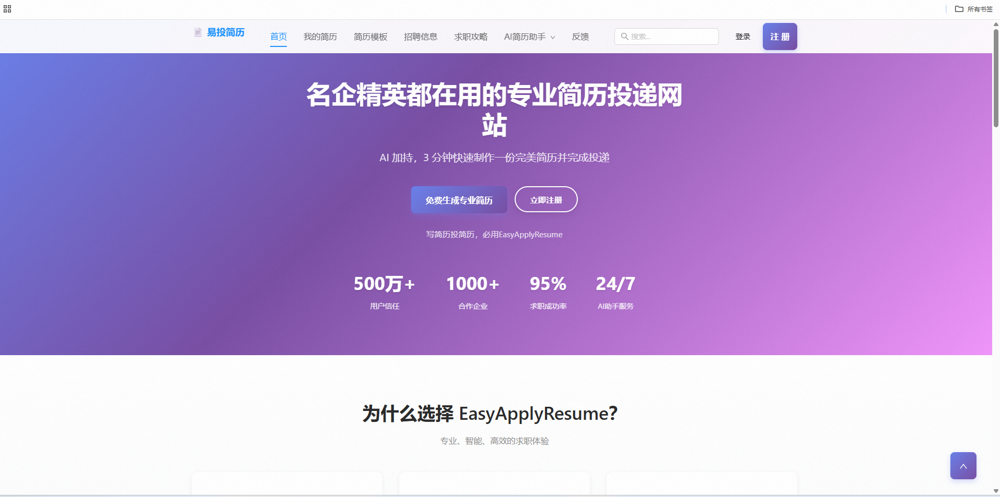

#### 2. 我的简历
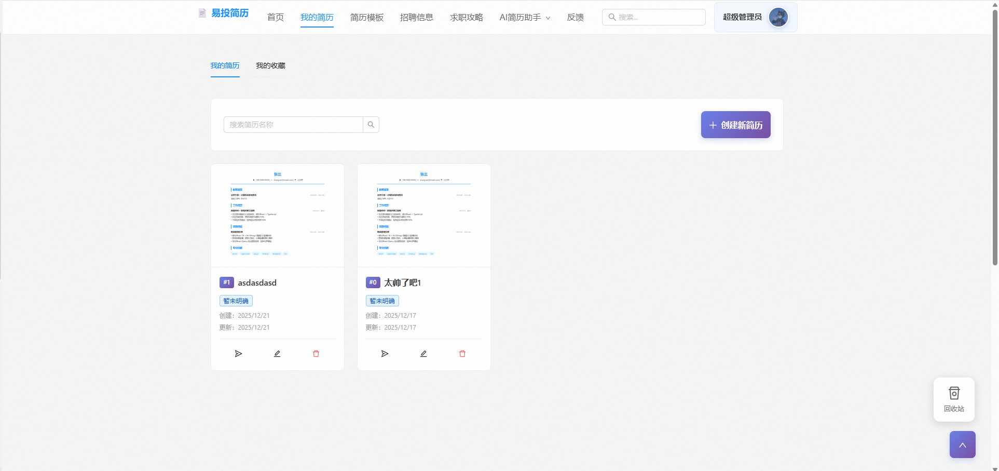

#### 3. 简历模板
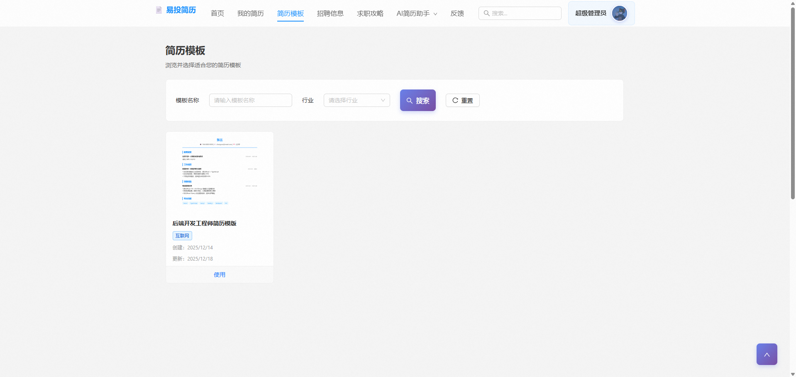

#### 4. 招聘信息
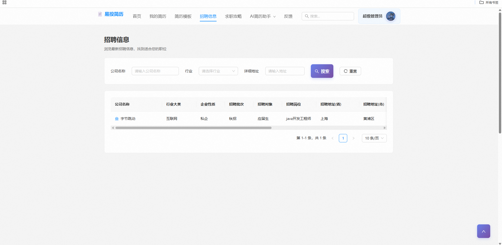

#### 5. 求职攻略
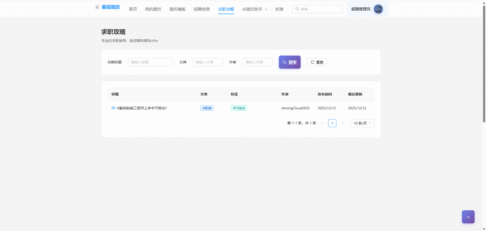

#### 6. AI简历助手

**AI智能问答助手**
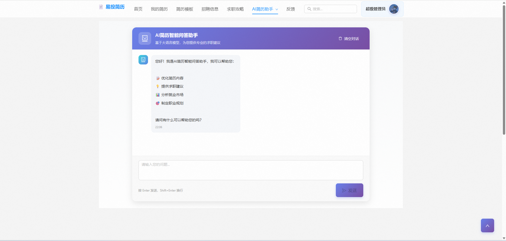

**AI智能体助手**
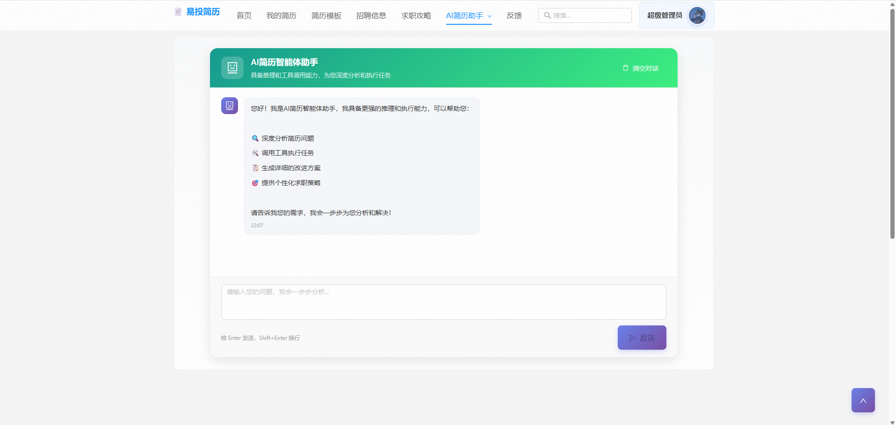

#### 7. 用户反馈
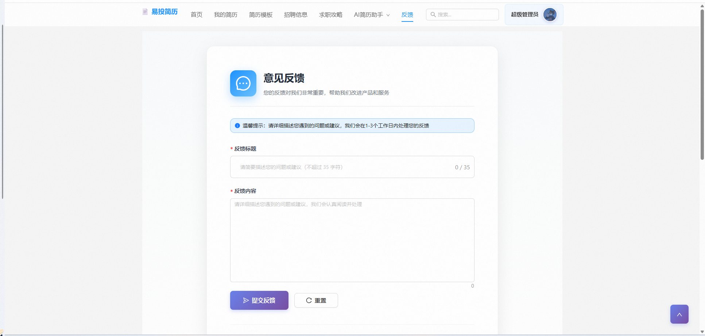

#### 8. 用户基础功能
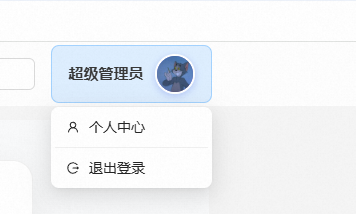

</details>

### 🔧 管理端

<details>
<summary><b>点击展开管理端截图</b></summary>

#### 1. 门户页
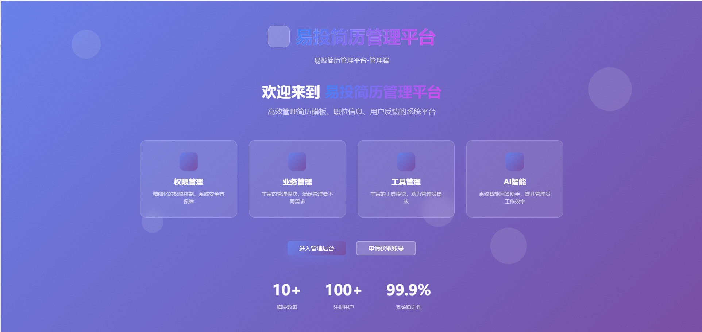

#### 2. 首页
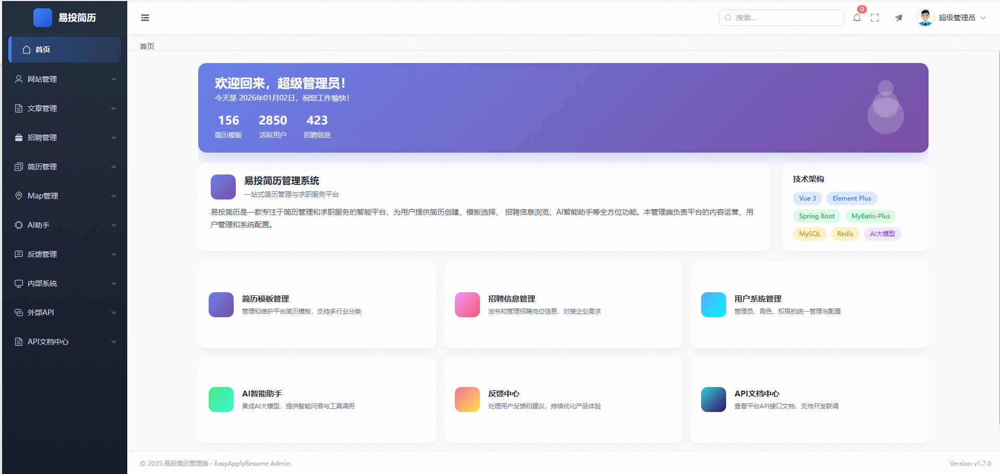

#### 3. 网站管理

**管理员管理**


**角色管理**


**权限管理**


#### 4. 文章管理

**求职攻略文章管理**


#### 5. 招聘管理

**招聘岗位管理**


**招聘信息管理**


#### 6. 简历管理

**简历模板管理**


**系统删除简历管理**


#### 7. Map管理

**行业Map管理**


#### 8. AI助手

**AI智能问答助手**


**AI智能体助手**


#### 9. 反馈管理

**用户端反馈管理**


**管理端反馈管理**


**用户端反馈记录**


**管理端反馈记录**


#### 10. 内部系统

**易投简历用户端**


**易投简历监测与广告端**


#### 11. 外部API

**高德开放平台（示例）**


#### 12. API文档中心

**API对外文档中心**


**API对内文档中心**


</details>

### 📊 监测与广告端

<details>
<summary><b>点击展开监测端截图</b></summary>

#### 1. 门户页


#### 2. 首页


#### 3. 公告管理（以管理端公告为例）


#### 4. 广告管理

**图片广告管理（以管理端广告为例）**


#### 5. 用户监测管理

**网站管理**


#### 6. 服务器管理

**设备管理**


**设备监控**


#### 7. 网站安全管理

**SpringBootAdmin**


**Prometheus**


**Grafana**


</details>

---

## 📁 项目结构

```
EasyApplyResume/
├── app/                          # 前端项目
│   ├── admin/                    # 管理端 (Vue3)
│   ├── user/                     # 用户端 (React)
│   └── ad_monitor/               # 监测端 (Vue3)
├── src/                          # 后端源码
│   └── main/java/com/zyh/easyapplyresume/
│       ├── controller/           # 控制器层
│       │   ├── user/             # 用户端接口
│       │   ├── admin/            # 管理端接口
│       │   └── ad_monitor/       # 监测端接口
│       ├── service/              # 业务逻辑层
│       ├── mapper/               # 数据访问层
│       ├── model/                # 实体模型
│       │   ├── pojo/             # 数据库实体
│       │   ├── vo/               # 视图对象
│       │   ├── form/             # 表单对象
│       │   └── query/            # 查询对象
│       ├── config/               # 配置类
│       ├── security/             # 安全认证
│       ├── filter/               # 过滤器
│       └── utils/                # 工具类
├── docker/                       # Docker配置
│   ├── docker-compose.yml
│   └── nginx/
└── README.md
```

---

## 📋 开发进度

### ✅ 已完成

- [x] 用户端核心业务（简历管理、模板、招聘信息、求职攻略）
- [x] 管理端核心业务（用户管理、内容管理、反馈管理）
- [x] 监测端核心业务（数据统计、广告公告、服务器监控）
- [x] AI智能问答助手
- [x] AI智能体助手（基于Coze）
- [x] JWT双Token认证
- [x] Docker容器化部署

### 🚧 开发中 / 规划中

**用户端扩展：**
- [ ] 为简历模板提供AI大模型智能体，给用户提供简历代码、简历文字等
- [ ] 为制作简历提供AI大模型智能体，给用户提供简历评分、简历关键字提取等
- [ ] 为投递简历制作Agent-flow，实现自动投递简历（核心技术：RPA + Agent-Flow）

**监测与广告端扩展：**
- [ ] 远程服务器终端操作模块（类似低配版Xshell）
- [ ] 视频广告管理

**其他：**
- [ ] OSS优化：KODO中间件需要域名加速器，等域名正式完成后才能上传文件

---

## ❓ 常见问题

| 问题 | 说明 |
|------|------|
| OSS孤儿数据 | 文件上传后未关联业务数据的处理 |
| Redis数据同步 | 缓存与数据库的一致性问题 |
| 业务流转 | 各业务模块之间的数据流转 |
| 基于Coze搭建智能体 | AI智能体的配置与接入 |
| Agent-flow | 自动化流程的设计与实现 |
| SpringAI | 大模型相关业务的集成 |
| 双Token | 认证Token与刷新Token的机制 |
| KODO配置与使用 | 七牛云对象存储的配置 |

---

## 👥 项目适用人群

本项目适用于：

- 🎓 想学习 **Spring Boot 全家桶** 的编程小白
- 🤖 想学习 **Spring AI 框架** 的程序员
- 💼 对 **Java 全栈开发** 感兴趣的其他行业从业者
- 📚 需要 **毕设/课设参考** 的在校学生

---

## 🤝 参与贡献

欢迎任何对项目感兴趣的开发者参与贡献！在此先提前感谢您的贡献！

### 贡献类型

| 类型 | 说明 |
|------|------|
| 🔧 代码类 | 新增功能、修复Bug、重构代码、性能优化 |
| 📝 文档类 | 完善README、补充API文档、翻译说明、修正错别字 |
| 🧪 测试类 | 编写单元测试、集成测试、优化测试用例 |

### 贡献流程

1. **提交 Issue（必要前置）**
   - 新增功能、修复未记录的Bug、提出优化建议等，需先在Issue区描述背景、需求和方案
   - 标题格式：`[类型] 具体描述`
   - 示例：`[Feature] 新增用户角色管理功能`、`[Bug] 登录接口空参数返回500错误`

2. **分支管理**
   - 主分支（如 `prod`、`dev`）仅用于合并稳定代码
   - 子分支命名：`类型/Issue编号-简短描述`
   - 示例：`feature/123-user-role`、`fix/456-login-error`

3. **代码编写与提交**
   - 代码风格：遵循 Alibaba Java 规范、ESLint 规则
   - 提交前执行格式化：`mvn spotless:apply`、`npm run lint`
   - Git 提交信息格式：`[类型] 描述（关联#Issue编号）`
   - 示例：`[Fix] 修复登录空参数500错误（#456）`

4. **提交 Pull Request**
   - 目标分支：默认选择 `feature`
   - PR 内容：关联 Issue、说明功能/修复逻辑、测试情况、兼容性影响

---

## 📄 开源协议

本项目采用 [MIT License](LICENSE) 开源协议。

**本项目可以直接使用、二开，但需遵守 MIT 协议！**

---

## 👨‍💻 作者

**赵云翰 (shiningCloud2025)**

---

<p align="center">
  如果这个项目对你有帮助，请给一个 ⭐ Star 支持一下！
</p>
